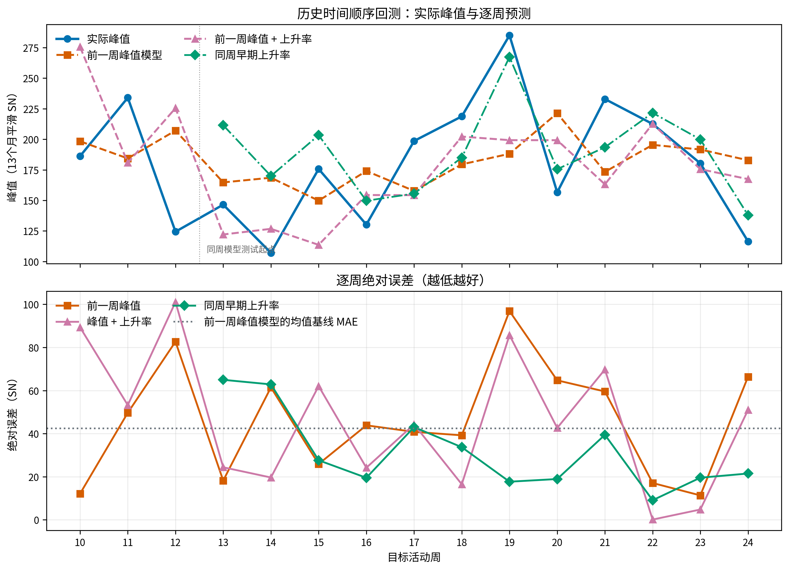
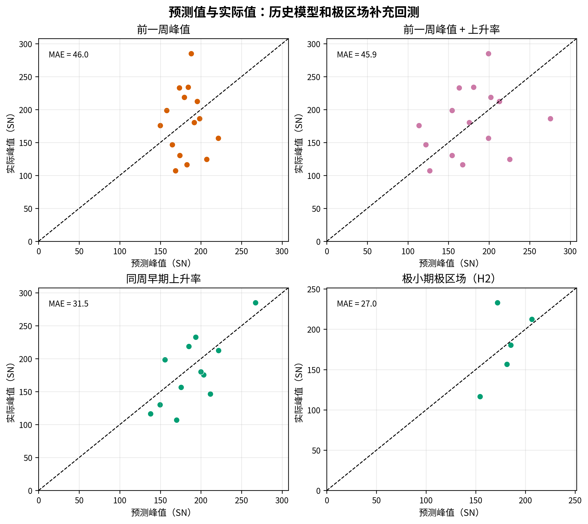
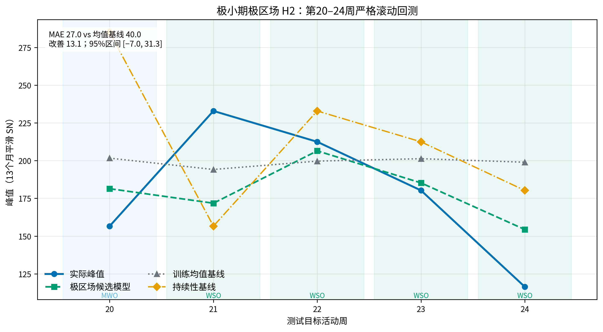
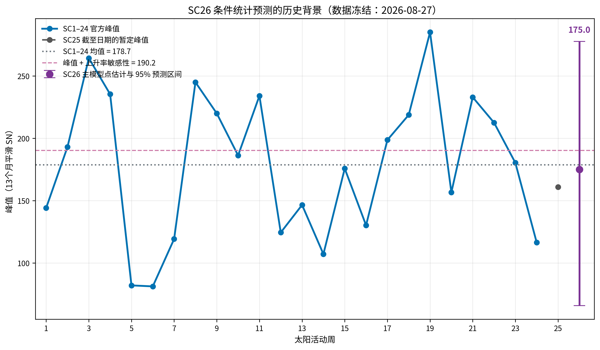

# JW 太阳活动周历史预测回测与第 26 周期条件预测

> **2026-08-29 复核：** 使用当前代码对同一登记输入重跑历史回测与 H2 极区场实验；数值与前一版一致，未引入新的 SC26 极区前兆标签。新增复核产物位于 `research/review/evals/runs/current_best_20260829/`。

## 结论先行

截至 2026 年 8 月 27 日，JW 对太阳活动周峰值的预测证据可以概括为三层：

1. **历史形态模型有一定回测价值，但不确定性仍然较大。** 用同一活动周极小期后的早期上升率预测该周峰值，在第 13—24 周的时间顺序回测中，MAE 为 **31.5**，训练均值基线为 **42.7**，点估计改善 **11.2**；但改善的 95% 区间为 **[−5.9, 31.3]**，仍覆盖零。
2. **只用前一活动周峰值的跨周模型没有显示稳定技能。** 第 10—24 周回测的 MAE 为 **46.0**，训练均值基线为 **42.4**，改善为 **−3.6**，95% 区间为 **[−11.6, 3.9]**。加入前一周上升率后，MAE 为 **45.9**，改善为 **−3.5**，95% 区间为 **[−21.7, 13.5]**。
3. **极小期极区场模型显示有利方向，但证据仍不足以称为稳定预测技能。** 第 20—24 周的五个严格滚动测试折中，候选模型 MAE 为 **27.0**，训练均值基线为 **40.0**，点估计改善 **13.1**；固定种子、10,000 次活动周级 bootstrap 的 95% 区间为 **[−7.0, 31.3]**，仍覆盖零。

对于第 26 太阳活动周，当前可复核的主模型给出 13 个月平滑太阳黑子数峰值**点估计 175.0**，95% 预测区间 **[65.8, 277.7]**。加入上升率的敏感性模型为 **190.2**，第 1—24 周历史均值为 **178.7**。因此，175.0 应理解为接近历史平均水平的条件统计预测，置信度为**低**；很宽的区间比单一数字更能反映当前证据。

## 1. 预测对象与数据范围

预测对象是 WDC-SILSO v2.0 定义的 **13 个月平滑太阳黑子数峰值**。活动周由官方极小期和极大期界定。历史回测使用第 1—24 周的完整周期；第 25 周只作为第 26 周预测的已知前驱，不能把它当作已经完成的回测目标。

本次可复核数据包括：

- SILSO v2.0 月度总太阳黑子数；
- SILSO v2.0 13 个月平滑序列和官方活动周极值；
- MWO–WSO 极区孔径场前兆序列，用于补充检验极小期极区场假设。

月度记录在模型中先聚合到活动周级别；因此“24 个完整活动周”是样本量，不应把月度行数当成更多独立样本。相邻活动周之间还可能存在序列依赖，MWO 与 WSO 也属于不同测量制度。

## 2. 历史预测模型与回测设计

### 2.1 同周早期上升率模型

对每个活动周，取官方极小期后第 7—24 个月的原始月均太阳黑子数，使用 OLS 斜率描述早期上升速度，再预测同一活动周的最终峰值。时间顺序回测先用前 12 个活动周训练，再逐周预测第 13—24 周；每个测试周期都只能使用当时之前的周期。

该模型对应 JW 的历史形态假设：上升越快，峰值往往越高。它的用途是检验历史预测关系是否可重复，不是证明“快速上升导致高峰值”。

### 2.2 前一周峰值模型

以活动周 (N-1) 的峰值预测活动周 (N) 的峰值。回测从第 10 周到第 24 周进行扩展窗口训练；每一折都重新计算训练均值基线。这个模型简单、透明，适合做跨周预测的条件基线。

### 2.3 前一周峰值加上升率模型

在前一周峰值之外，再加入前一周早期上升率。该模型用于检验上升形态能否在跨周任务中提供额外信息。它的参数更多，因此必须同时观察样本外误差、基线比较和不确定性，不能因为拟合变量更多就预先认为它更好。

### 2.4 极小期极区场模型（H2）

极小期极区场模型使用 MWO–WSO 的南北极区孔径场绝对值平均作为主前兆，以第 15—19 周作为初始训练窗口，逐周留出第 20—24 周，共 5 个测试折。校正后的分析同时保留两半球场强，并固定检查平方根均值、按目标峰值离散度加权和较弱半球三个敏感性模型。主模型与训练均值、持续性基线比较，并以活动周为单位进行 10,000 次 bootstrap；敏感性模型不依据同一测试集事后晋升。

该模型的样本外结果是当前历史预测中较有希望的一部分，但样本只有 5 个测试折；MWO 只覆盖 1 折，WSO 覆盖 4 折。三个敏感性模型的 MAE 为 25.9—26.8，略低于主模型，但各自的改善区间仍跨零。因此它支持“可能存在方向性改善”，还不支持“已经获得稳定预测技能”。

## 3. 历史回测结果

| 模型 | 时间顺序测试范围 | 测试周数 | 候选 MAE | 基线 MAE | MAE 改善 | 改善 95% 区间 | 胜出次数 |
|---|---:|---:|---:|---:|---:|---|---:|
| 同周早期上升率 → 同周峰值 | SC13–24 | 12 | 31.5 | 42.7 | 11.2 | [−5.9, 31.3] | 8 |
| 前一周峰值 → 下一周峰值 | SC10–24 | 15 | 46.0 | 42.4 | −3.6 | [−11.6, 3.9] | 7 |
| 前一周峰值 + 上升率 → 下一周峰值 | SC10–24 | 15 | 45.9 | 42.4 | −3.5 | [−21.7, 13.5] | 8 |
| 极小期极区场 → 下一周峰值 | SC20–24 | 5 | 27.0 | 40.0 | 13.1 | [−7.0, 31.3] | — |

“胜出次数”仅表示某一折的绝对误差小于对应基线，不能代替整体区间检验。四个模型的共同信息是：候选模型在部分周期上确实更接近实际值，但目前没有一个模型的改善区间能够排除零改善。

图 1 展示实际峰值、逐周预测和绝对误差。活动周峰值本身具有明显起伏；例如第 19 周的高峰和第 24 周的低峰，都对只依赖历史均值或前一周峰值的模型构成挑战。曲线能够显示每一折发生了什么，但模型优劣仍应以预先规定的 MAE、RMSE 和区间共同判断。

图 2 用完美预测对角线检视误差方向。前一周峰值模型的点云并未稳定贴近对角线；同周早期上升率和极区场模型在本次测试窗口内更接近对角线，但样本数较少，不能只凭视觉距离宣称泛化能力。

图 3 是 H2 主模型的 5 折回测。相对逐折训练均值基线的改善约为 **20.236、−22.344、6.794、16.018、44.561**，其中四折为正、一折为负。另一组“逐周留一”数值回答的是删去一折后的总体敏感性，不能与这里的单折改善混用。当前结果仍受小样本、相邻周期依赖和 MWO/WSO 制度差异限制。

## 4. 第 26 太阳活动周预测

### 4.1 主模型与输入

正式预测使用完成历史回测后冻结的“前一周峰值 → 下一周峰值”模型，并用第 25 周截至 2026 年 8 月 27 日得到的暂定平滑峰值 **160.9** 作为输入。模型在 SC2—SC24 的历史配对上拟合，再对 SC26 给出条件预测。

### 4.2 数值结果

| 预测方式 | SC26 峰值（13 个月平滑 SN） |
|---|---:|
| 主模型：前一周峰值 | **175.0** |
| 95% 预测区间 | **65.8 — 277.7** |
| 敏感性模型：前一周峰值 + 上升率 | **190.2** |
| SC1–24 历史均值 | **178.7** |

图 4 将 SC26 预测放回完整历史峰值序列中。175.0 与历史均值 178.7 很接近，说明主模型没有把 SC26 推向极端高峰或极端低谷；但 95% 区间很宽，覆盖了从低活动周到强活动周的较大范围。这个区间是统计预测区间，包含历史残差，不是太阳发电机物理参数的完整不确定性传播。

### 4.3 对 SC26 预测的正确解读

当前最稳妥的表述是：**在截至 2026-08-27 的 SILSO 历史数据和预先固定的跨周模型下，SC26 峰值的条件统计中心约为 175，预测不确定性很高。**

不能据此表述为：

- SC26 已被可靠锁定在 175 附近；
- 175 是太阳发电机机制推导出的确定值；
- 95% 区间代表物理机制本身的完整概率分布；
- H2 极区场回测已经为 SC26 提供了独立、可审计的极区场预测。

最后一条尤其重要：当前 H2 运行只完成了第 20—24 周的历史滚动评估，权威特征表没有为 SC26 注册可审计的第 25 周极小期极区前兆输入。因此，H2 的历史改善不能被直接改写成 SC26 的第二个正式预测。

## 5. 后续怎样提高预测稳定性

1. **扩大样本外窗口。** 保持时间顺序，增加可用活动周并报告逐折误差，避免用一次点估计替代长期验证。
2. **分离测量制度。** MWO 早期极区代理和 WSO 后期磁场观测应分别报告，合并结果只能作为部分证据。
3. **处理周期依赖。** 活动周级 bootstrap、留一周期检查和有效样本量界限应继续保留，不能把月度数据当作独立复制。
4. **补齐轴向偶极矩输入。** H3 需要真正的日面磁场拼图和固定谐波定义，才能与极区孔径场在同一滚动协议下比较；在数据补齐前，不为 H3 生成方向性结论。
5. **等待真实标签闭合 SC26 评估。** 只有 SC26 完成并获得官方极值标签后，才能计算这次预测的真实误差，并判断 175.0 是否落在事先给出的预测区间内。

## 6. 可复核文件与证据边界

本稿中的曲线由记录在案的 CSV/JSON 结果重新绘制，绘图脚本为 [`scripts/plot_jw_historical_sc26_forecast.py`](../scripts/plot_jw_historical_sc26_forecast.py)。相关历史预测数据和正式预测回执位于 `research/review/evals/runs/sc26_forecast_backtest_20260827/results/`；校正后的 H2 输入、模型指标、滚动预测和回执位于 `research/review/evals/runs/h2_polar_upgrade_20260828/results/`。本次 2026-08-29 复核的完整复制品位于 `research/review/evals/runs/current_best_20260829/`。

本稿区分四种证据：数据和特征是否真实登记、时间顺序回测是否实际执行、预测区间如何计算，以及科学结论能否推广。前两项已经有确定性运行记录；后两项仍受小样本、测量制度和缺少轴向偶极矩数据限制。图表是解释证据的工具，不会把低置信度统计结果升级为因果机制或确定性预测。
