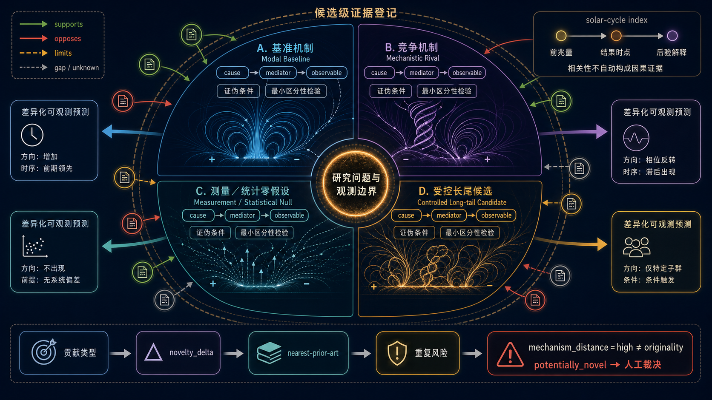
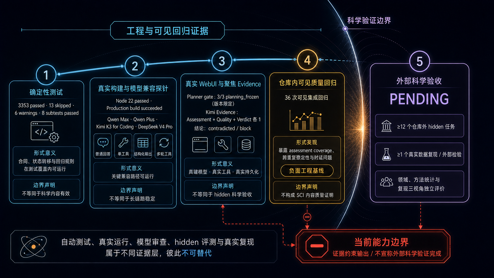

# 太阳活动 AI Scientist 科研能力报告

## 摘要

本项目面向太阳活动研究中的复杂推理、小样本统计和多源证据评价，研究如何利用多个专业 Agent 协同完成研究问题界定、数据准备、科学假设生成、计算分析、证据核验和结论综合。系统接收科研人员的自然语言问题，自主确定所需研究任务，并要求每个核心主张同时给出物理机制、可观测预测、可证伪条件、替代解释、现有证据和下一项检验。

当前版本已经能够生成结构完整、低置信且明确可检验的探索性假设，并能在证据不足时限制结论强度。一次真实 WebUI 研究中，系统检验了“上一太阳活动周较长可能削弱极小期极区场对下一活动周振幅的预测关系”，同时保留最强零假设、测量制度混杂和周期级统计边界。实验得到交互系数 **β3=12.0217**，周期级区间 **[−71.2719, 106.2204]**，交互模型样本外误差高于加性模型；当前材料不支持负交互，也没有宣称原创性。

这些结果说明系统已经具备较强的科研选题与预研假设生成能力。现有证据仍不足以证明其能够稳定产生具有直接实证支持、原创性已经核验或可写入论文结论的科学发现。

**关键词：** AI Scientist；太阳活动；科学假设；极区磁场；证据评价；小样本统计；可证伪性

## 1. 研究目标与科学范围

### 1.1 研究目标

项目目标是使 AI Scientist 在无需科研人员了解系统内部实现的情况下，能够从一个自然语言研究问题出发，形成可供同行检查的研究材料。核心要求包括：

1. 明确研究对象、时间范围、变量定义和观测截止日期。
2. 给出可证伪的科学假设，而非只有背景知识或宽泛猜想。
3. 区分物理机制、统计关联、测量误差和数据处理影响。
4. 为每条关键主张列出支持证据、反对证据、适用限制和证据缺口。
5. 预先说明估计对象、独立样本单位、统计方法、基线模型和判断依据。
6. 如实报告未观察到预期效应、样本功效不足或证据无法支持结论的情况。
7. 不编造数据、数值结果、文献内容或原创性优先权。

### 1.2 太阳活动研究的主要难点

太阳活动研究具有若干不能由通用文本生成能力替代的科学约束：

- 独立太阳活动周数量有限，月度记录不能被当成大量独立样本。
- 极区场、太阳黑子数和活动周极值的定义依赖平滑方法、观测时间和资料版本。
- MWO 光斑代理、WSO 磁像仪及其他观测资料之间可能存在测量制度差异。
- 前兆关系的相关性不能单独证明 Babcock–Leighton 发电机或其他物理机制。
- 当前活动周的实时判断与事后确认结果必须严格区分。
- 数值模拟、综述和摘要能够提供理论背景，但不能替代范围匹配的直接观测证据。

因此，系统评价重点放在问题是否明确、假设能否被推翻、统计设计是否可信、证据是否真正支持主张，以及结论强度是否与证据相称。

## 2. 科学研究方法

### 2.1 研究问题界定

研究规划 Agent 首先把自然语言问题转化为明确的科研问题，至少确定：

- 研究对象和目标现象；
- 时间索引与太阳活动周编号；
- predictor、outcome、mediator 和可能的 confounder；
- 允许使用的数据及观测截止日期；
- 需要回答的关联、预测或机制问题；
- 能够支持、削弱或无法判断假设的结果。

涉及经验检验或预测时，研究计划必须明确估计对象、独立样本单位、实际独立样本数、主分析、对照基线、样本外检验方法、缺失值处理、不确定性估计和敏感性分析。

### 2.2 科学假设组合

对于存在多种解释的问题，科学假设 Agent 原则上形成以下候选：

- 领域已有研究普遍采用的基线解释；
- 物理机制上不同的竞争解释；
- 测量误差或统计波动解释；
- 一至两个值得探索的新联系或新预测。

每个候选均需说明：

- cause→mediator→observable 的时间关系；
- 必要条件和适用范围；
- 与其他候选不同的预测；
- 最强反例和可证伪条件；
- 现有证据的支持程度；
- 最便宜且仍有区分力的下一项检验。

*图 1　科学假设组合的机制多样性、证据关系与区分性预测*

### 2.3 物理机制与因果边界

假设必须使用明确的太阳活动周编号和时间顺序，区分前兆量、同期指标和事后解释。相关性只能支持统计联系；若要加强物理机制解释，还需要满足时间先后、变量定义一致、替代解释受到控制，以及不同数据或方法得到相容结果等条件。

机制的流行程度、模拟中的可实现性或表达上的新颖感均不能提高实证置信度。没有直接观测或计算结果时，候选保持探索性。

### 2.4 原创性评价

原创性评价与假设生成分开进行。每个候选应说明其贡献属于已有基线的严格复核、机制扩展、新预测、新数据联系、新方法应用，还是测量与统计解释。

原创性检索至少覆盖：

1. 核心物理机制；
2. 机制与目标观测量的组合；
3. 最强竞争解释或零假设。

系统需要列出最接近的已有工作、双方重叠内容、真正新增部分和仍未排除的重复风险。没有找到足够的最近先行工作时，只能说明原创性尚未评价，不使用“首次”或优先权表述。

## 3. 专业 Agent 的科研职责

| 专业 Agent | 负责的科研任务 | 主要输出 |
| --- | --- | --- |
| 研究规划 Agent | 明确研究问题、观测范围、方法和停止条件 | 可执行的研究计划与统计分析说明 |
| 数据 Agent | 核对来源、整理变量、记录测量口径和缺失情况 | 可复查的数据表、来源说明和测量限制 |
| 科学假设 Agent | 形成机制不同且可证伪的候选 | 假设陈述、机制、预测、反例和下一项检验 |
| 自动实验 Agent | 按预先说明的方法完成真实计算 | 代码、参数、数值结果、不确定性和敏感性分析 |
| 证据审查 Agent | 核验主张与来源是否对应，主动寻找反证 | 逐条证据评价、方法问题和结论强度建议 |
| 结果综合 Agent | 汇总已得到证据评价的科学内容 | 不超出已有证据的研究结论 |

Qwen Max 负责研究规划、科学假设、计算实验和结果综合；Qwen Plus 负责较轻量的数据与知识辅助；Kimi K3 for Coding 负责长文档阅读和逐条证据评价。模型分工不能代替证据本身，也不能把模型间意见一致当成科学事实。

## 4. 证据评价方法

### 4.1 逐条主张与证据对应

每条影响研究结论的主张都要记录以下信息：

| 评价内容 | 科学问题 |
| --- | --- |
| 主张组成 | 属于事实陈述、物理机制、预测、适用范围、数值结果还是结论？ |
| 证据关系 | 来源支持、反对、限制该主张，还是只显示证据缺口？ |
| 来源类型 | 属于直接观测、计算实验、数值模拟、方法论文、综述还是数据说明？ |
| 直接程度 | 来源是否直接讨论相同变量、时间范围和研究对象？ |
| 范围一致性 | 来源的样本、时间、测量方法和结论范围是否与主张一致？ |
| 独立性 | 多个来源是否共享同一数据集或同一模型，因而不能算作独立重复？ |
| 精确位置 | 能否定位到页码、章节、段落、表格或计算结果？ |
| 结论上限 | 该来源最多允许形成探索性判断、受证据限制的结论，还是较强结论？ |

只有论文题目、DOI、文件路径或检索命中不能证明来源支持主张。摘要、综述、Wiki 和模拟结果能够提供背景或有限支持，但不能单独承载高置信的观测机制结论。

### 4.2 Full-text 阅读与反对证据

证据审查 Agent 可以阅读任务本地且合法可用的 PDF、Markdown、HTML 和项目缓存，并按页码或章节定位相关内容。正文不可获得时，系统记录证据缺口，不用摘要补写正文中不存在的结论。

每个主要机制都应主动寻找最强反对证据、测量零解释和竞争机制。没有找到反对证据只能说明检索仍有缺口，不能反向证明原假设成立。

### 4.3 结论强度

结论强度由直接性、范围一致性、来源独立性、统计方法和未解决问题共同决定：

- 只有背景知识或摘要时，最多形成探索性判断；
- 有范围匹配的直接观测，但样本很小或方法限制明显时，只能形成受证据限制的结论；
- 较强结论需要直接证据、清楚的不确定性、独立证据来源和对替代解释的系统检验。

当现有材料无法判断时，系统直接说明缺少什么数据或文献，不用完整叙事掩盖证据不足。

## 5. 太阳活动小样本的统计要求

太阳活动周级研究必须遵守以下要求：

- 独立样本单位为太阳活动周时，月度或日度重复观测不能扩大独立样本数。
- 时间序列预测优先采用 rolling-origin、temporal holdout 或 external holdout。
- 训练样本中的相关性不能被称为样本外预测能力。
- 同时报告 MAE、RMSE、基线差异、逐次留出误差和高影响活动周。
- MAE 与 RMSE 给出矛盾判断，或少数活动周决定整体结果时，结论强度必须降低。
- 小样本分析需要与研究设计相容的 bootstrap、permutation 或其他不确定性估计。
- 应执行 leave-one-cycle-out 影响分析，说明删除单个活动周后结论是否改变。
- proxy、仪器或数据处理方法发生变化时，需要分层分析或敏感性分析。
- 预先指定的分析未支持假设后，不能反复使用同一检验样本选择模型以追求正结果。

结果报告应明确区分：未观察到预期效应、结果方向与假设相反、估计区间包含零、样本功效不足，以及数据质量不足以判断。这些情况具有不同的科学含义。

## 6. 真实科研问题示例

### 6.1 用户问题

仓库外验证使用以下自然语言问题直接启动 production build WebUI：

> 在太阳活动周15至24的逐周期观测中，上一活动周较长是否会削弱极小期极区场强对下一活动周振幅的预测关系？请提出一个最值得检验、可证伪的交互作用假设，并说明现有证据与最强零假设。

科研人员只提供研究问题，没有提供内部指令或分析步骤。系统使用 Qwen 生成数据说明和科学假设，使用 Kimi K3 for Coding 核验证据及方法边界。

### 6.2 系统生成的科学假设

系统提出：上一太阳活动周较长可能削弱极小期极区场对下一活动周振幅的预测关系。

若以 $A_{N+1}$ 表示下一活动周振幅、$P_N$ 表示第 $N$ 周期极小期极区场、$L_N$ 表示第 $N$ 周期长度，则待检验模型为：

$$
A_{N+1}=\beta_0+\beta_1P_N+\beta_2L_N+\beta_3(P_N\times L_N)+\varepsilon_N.
$$

核心预测为 $\beta_3<0$：周期越长，极区场与下一周期振幅之间的预测斜率越平。该假设只规定统计交互方向，没有声称周期长度因果地改变下一周期振幅。

### 6.3 必要条件与可证伪结果

必要条件包括：

- 极区场对下一周期振幅具有可检测的主效应；
- 周期长度能够反映与磁通输运或衰变时间有关的差异；
- MWO 光斑代理与 WSO 磁像仪资料能够比较，或在分析中分别处理。

以下结果会削弱或否定该候选：

- $\beta_3$ 的不确定性区间包含零或主要位于正侧；
- 长、短周期子样本中的斜率方向不一致；
- 删除任一活动周后交互符号翻转；
- 仅使用磁像仪资料时交互消失；
- 交互模型没有改善样本外误差，且结果对变量定义高度敏感。

### 6.4 最强零假设与替代解释

最强零假设为 $\beta_3=0$：极区场预测斜率不随上一周期长度改变，拟合出的交互只是约十个相互依赖活动周上的过参数化噪声。

其他替代解释包括：

- 极区场与周期长度共线，交互项只是在重新分配主效应；
- MWO 与 WSO 的测量制度差异形成表观交互；
- 追溯性极小期和平滑振幅定义改变了周期长度或振幅；
- 单个高影响活动周决定交互方向；
- 线性交互形式不能描述真实关系。

### 6.5 现有证据

| 主张或材料 | 证据关系 | 当前科学判断 |
| --- | --- | --- |
| 极区场×周期长度交互为负 | 反对与限制 | β3 点估计方向相反、区间跨 0，交互模型样本外误差高于加性模型 |
| 活动周15—24构成小依赖样本 | 限制 | 样本量限制统计功效与区间精度，月度记录不能扩大独立样本数 |
| 第15—21周使用 MWO 光斑代理，第22—24周使用 WSO 磁像仪 | 限制 | 混合测量制度可能伪造、掩盖或反转交互方向 |
| 极区场采用南北绝对值平均 | 限制 | 该变量不能解释为带符号的极性指标 |
| 极小期由中心平滑追溯确认 | 限制 | 该研究只能进行回顾性检验，不能直接形成实时预测 |
| 最近先行工作 | 证据缺口 | 尚未找到足够的最近先行工作，原创性无法判断 |

现有材料不支持负交互本身，也不能证明正交互或交互严格为零。系统已经给出交互估计、区间、滚动样本外误差和敏感性结果，但没有给出因果结论或原创性判断。因此，该候选仍属于低置信的探索性假设，当前科学支持度低，复验研究优先级较高。

### 6.6 下一项检验

下一项研究应在已完成分析的基础上优先完成以下复验：

1. 由相邻太阳活动极小日期构造周期长度，并核对活动周编号和端点定义。
2. 使用 MWO/WSO 重叠期进行交叉定标，冻结统一口径后再复验原交互项。
3. 保持主效应、交互模型、周期级重抽样和滚动原点规则不变，避免看到结果后改动估计量。
4. 扩展或均一化周期样本，量化功效与最小可检测交互幅度。
5. 继续报告逐周期留一、极小日期定义和测量制度敏感性。

当前逐周期表中只有三个活动周使用 WSO 磁像仪资料，不能仅凭这三个样本估计包含主效应和交互项的完整模型。磁像仪资料分析只能用于检查结果是否明显依赖混合测量制度；若有效样本仍不足，应报告无法判断，而不能据此确认或否定交互。

只有负交互估计方向稳定、区间不跨 0、样本外误差优于加性模型，且不由少数活动周或测量制度变化驱动，才可以提高假设置信度。

### 6.7 本例结论

本次运行表明，系统可以从普通科研问题形成方向明确、可证伪的科学假设，真实执行周期级统计检验，并在结果不支持原方向时保留阴性结论。现有评价只针对本次任务提供的材料，没有完成领域文献层面的系统比较。该结果不能说明负交互真实存在，也不能说明该候选具有原创性。

详细记录见[真实科研运行记录](../research/review/REAL_CLOSED_LOOP_RUN_LOG.md)和[科学质量说明](../research/review/SCI_PEER_PRE_REVIEW_STATUS.md)。

## 7. 当前验证证据

不同检查支持不同层次的结论，必须分别解释。

*图 2　系统运行、真实模型与科学结论之间的证据边界*

| 已完成的检查 | 观察结果 | 可以说明什么 | 仍不能说明什么 |
| --- | --- | --- | --- |
| Python 自动测试 | `3401 passed, 13 skipped, 6 warnings, 8 subtests passed` | 已测试的软件行为符合预期 | 不能证明科学主张正确 |
| WebUI 自动测试与构建 | Node `25 passed`，production build 成功 | 前端和主要集成功能可以运行 | 不能证明假设质量或证据判断正确 |
| 真实模型最小测试 | Qwen Max、Qwen Plus、Kimi K3 for Coding 和 DeepSeek V4 Pro 均完成普通回答、单工具、结构化输出和多次工具调用 | 当前模型配置能够执行所需操作 | 不能证明长任务稳定或科学判断可靠 |
| 聚焦的 Evidence 测试 | Kimi 阅读完整 Markdown 和 CSV 后，指出独立样本只有三个太阳活动周、月度记录不能扩大样本量、CSV 为 synthetic placeholder | 系统能够拒绝方法无效或来源不足的结论 | 单例不能证明对未知问题具有稳定判断能力 |
| 仓库外 WebUI 问题 | 系统生成负交互假设并明确现有证据只构成限制和缺口 | 系统能够生成受证据约束的探索性假设 | 不能证明该交互成立或具有原创性 |
| 36 次仓库内可见测试 | 21 次得到回答，2 次结束但没有回答，13 次出现运行错误；核心结论稳定性和证据完整性未达到预定要求 | 揭示了稳定性、时延和证据呈现问题 | 不能作为科学质量证明 |

仓库外问题的完整成功运行耗时 2248.582 秒，约 37.5 分钟。在五次同类真实运行中，一次形成完整科研结果，四次因软件兼容问题未形成完整结果。这组观察说明系统具备真实生成能力，同时表明可靠性和响应时间仍需明显改善。

## 8. 当前能够生成的科学假设水平

当前系统能够形成：

- 领域已有基线的严格复核假设；
- 带有新调节变量或新观测预测的探索性候选；
- 物理机制不同的竞争解释；
- 测量误差、资料制度变化或统计波动解释；
- 对证据不足、样本功效不足和未观察到预期效应的明确判断；
- 可以直接转化为数据分析的变量定义、模型形式和检验方案。

这些内容适合用于课题组预研、开题讨论、分析预注册和数据检验设计。当前系统尚未证明能够稳定形成：

- 有直接经验结果支持的原创科学发现；
- 已排除最近先行工作重复风险的核心论文假设；
- 经外部数据复现的机制结论；
- 可直接写入科研论文结果与讨论部分的定量结论。

因此，当前能力可概括为“较强的探索性科研假设与预研方案生成”，不能概括为“自动发现已经得到证实的新规律”。

## 9. 研究限制与后续工作

### 9.1 科学质量评价

使用十个可见太阳物理问题建立统一比较基准，并在方法和评价标准确定后重复运行，考察核心结论、证据关系和限制条件是否稳定。

还需要由独立标注验证：

- 关键主张是否都有对应证据；
- 支持、反对和限制关系是否判断正确；
- 来源内容是否真正推出相应主张；
- 预先设置的反对证据和范围冲突能否被发现；
- 没有直接证据时，系统是否始终避免提高结论强度。

### 9.2 仓库外问题与真实复现

在实现和评价标准确定后，应加入至少十二个未参与开发的仓库外太阳物理问题。至少选择一个有价值候选完成真实数据复现或外部数据检验，并由太阳物理、统计方法和复现研究人员分别评价。

### 9.3 运行可靠性与效率

当前真实任务耗时约三十至四十分钟，部分模型调用没有带来相称的新证据。后续需要减少重复文献检索、重复读取和格式纠错，同时保持证据评价和方法检查的完整性。

### 9.4 结论边界

自动测试、真实模型调用和可见问题验证可以说明系统已经具备实际运行能力。科学有效性仍需要仓库外问题、真实数据复现和独立专业评价共同支持。任何单次成功均不能单独证明系统达到科研期刊认可水平。

## 10. 结论

本项目已经建立从自然语言科研问题到科学假设、数据分析方案和逐条证据评价的多 Agent 研究系统。当前真实结果表明，系统能够生成结构完整、方向明确、可被数据推翻的探索性假设，并能在缺少直接证据时限制结论强度。

以极区场与太阳活动周长度的交互问题为例，系统给出了清楚的统计预测、最强零假设、测量制度影响和下一项检验，同时明确现有证据不能支持交互存在或原创性判断。这类结果已经能够为科研人员提供有价值的预研候选和分析设计。

下一步工作的重点是完成真实数据分析、系统性最近先行工作检索、仓库外问题验证和独立专业评价。只有这些证据共同支持系统表现，才能进一步判断其是否具备稳定生成高质量科研研究材料的能力。
