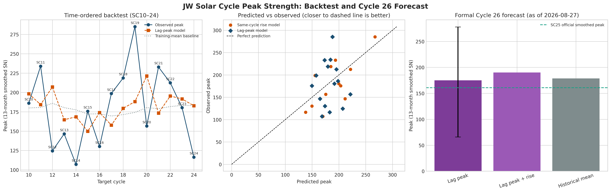

# 第26太阳活动周：从历史回测到正式预测

## 一句话结论

JW Agent 在严格时间顺序回测后给出的 SC26 峰值统计预测为 **175（13个月平滑 SILSO SN）**，95%预测区间 **66–278**。区间很宽，原因是历史跨周模型没有显示出超过简单均值基线的稳定优势；因此这是一份可复核的低置信度条件预测，不是物理确定值。

## 我们实际验证了什么

- 使用官方 SILSO Version 2.0 月度、13个月平滑序列和活动周极值表；
- SC1–24 作为完整历史样本，SC25 仅作为 SC26 的前驱输入；
- 每一个历史测试周只使用时间上先于它的已结束活动周，避免未来信息泄漏；
- 每个预测同时和“只取训练历史均值”的基线比较；
- 用 10,000 次固定种子 bootstrap 给出误差改进区间和正式预测区间。

## 历史表现

| 模型 | 测试周 | MAE | 均值基线 MAE | 改进 | 95%区间 |
|---|---:|---:|---:|---:|---:|
| 同周早期上升率 | 12 | 31.5 | 42.7 | +11.2 | −5.9–31.3 |
| 前一周峰值 → 下一周峰值 | 15 | 46.0 | 42.4 | −3.6 | −11.6–3.9 |
| 前一周峰值+上升率 | 15 | 45.9 | 42.4 | −3.5 | −21.7–13.5 |

第一行显示早期上升率在这组历史数据上有可见的预测信号，但不确定性仍跨零；跨周模型更直接对应 SC26，却没有通过基线优势检验，所以我们保留宽区间并降低置信度。

## 正式 SC26 结果

- SC25 官方平滑峰值：160.9；
- 主模型点估计：174.99；
- 敏感性模型（加入 SC25 早期上升率）：190.21；
- SC1–24 历史均值：178.70；
- 主模型 95%预测区间：65.81–277.66。

## 评委应如何理解

这项工作的亮点不是给出一个看似精确的数字，而是把“模型有没有真实预测能力”放到历史上先检验，再对 SC26 给出带区间、带基线、带失败边界的正式答案。未来只有在 SC26 完成并有官方极值标签后，才能进行最终盲后评估。

完整数据清单、程序输出和会话记录见：

- [历史回测报告](../research/review/evals/runs/sc26_forecast_backtest_20260827/results/sc26_historical_backtest_report.md)
- [正式预测 JSON](../research/review/evals/runs/sc26_forecast_backtest_20260827/results/sc26_formal_forecast.json)
- [会话记录](sc26_forecast_backtest_session_log.md)
