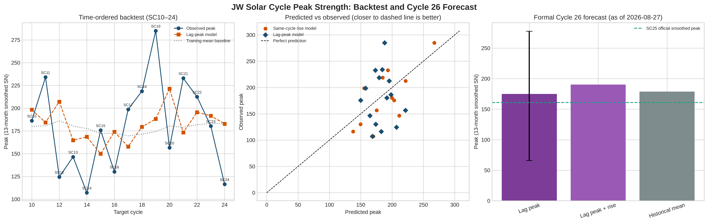

# 第26太阳活动周：历史回测与正式统计预测

## 结论先行

截至 2026-08-27，主模型给出的第26周 13个月平滑太阳黑子数峰值点估计为 **175.0**，95%预测区间为 **[65.8, 277.7]**。置信度为**低**：SC10–24 时间顺序回测中，前一周峰值模型 MAE 为 46.0，训练均值基线为 42.4，改进 -3.6，bootstrap 95%区间 [-11.6, 3.9]；区间跨过零，不能声称稳定预测技能。

## 数据与可复核性

使用在线取得并保存的 WDC-SILSO Version 2.0 月度总太阳黑子数、13个月平滑序列和官方活动周极值表。输入文件、SHA-256、下载日期、脚本命令和标准输出见同目录 `session_log.md` 与 `data_manifest.json`。SC1–24 是完整历史样本；SC25 只作为第26周预测的已知前驱，峰值从官方平滑序列中重建，未把SC25当完整回测目标。

来源： [SILSO monthly total](https://www.sidc.be/SILSO/DATA/SN_m_tot_V2.0.txt)、[SILSO smoothed monthly](https://www.sidc.be/SILSO/DATA/SN_ms_tot_V2.0.csv)、[SILSO official cycle extrema](https://www.sidc.be/SILSO/DATA/Cycles/TableCyclesMiMa.txt)。

## 方法

1. **同周早期上升率**：官方谷值后第7–24个月原始月均值的 OLS 斜率；SC13–24 为扩展窗口时间顺序回测。
2. **跨周主模型**：用前一活动周峰值预测下一活动周峰值；SC10–24 为扩展窗口回测，训练均值为预先固定基线。正式SC26预测只在历史回测完成后，用SC25峰值拟合全SC2–24目标。
3. **不确定性**：固定随机种子 `20260827`，以活动周为重采样单位进行 10,000 次bootstrap。预测区间还叠加了历史残差，避免把回归均值误当作未来确定值。

## 逐周期数据

|   cycle | minimum_date        | maximum_date        |   peak |   rise_slope |   rise_months |
|--------:|:--------------------|:--------------------|-------:|-------------:|--------------:|
|       1 | 1755-02-01 00:00:00 | 1761-06-01 00:00:00 |  144.1 |   -0.0827657 |            76 |
|       2 | 1766-06-01 00:00:00 | 1769-09-01 00:00:00 |  193   |    4.08906   |            39 |
|       3 | 1775-06-01 00:00:00 | 1778-05-01 00:00:00 |  264.2 |    6.93674   |            35 |
|       4 | 1784-09-01 00:00:00 | 1788-02-01 00:00:00 |  235.3 |    8.09845   |            41 |
|       5 | 1798-04-01 00:00:00 | 1805-02-01 00:00:00 |   82   |   -0.55872   |            82 |
|       6 | 1810-07-01 00:00:00 | 1816-05-01 00:00:00 |   81.2 |    0.106708  |            70 |
|       7 | 1823-05-01 00:00:00 | 1829-11-01 00:00:00 |  119.2 |   -0.132921  |            78 |
|       8 | 1833-11-01 00:00:00 | 1837-03-01 00:00:00 |  244.9 |    8.91331   |            40 |
|       9 | 1843-07-01 00:00:00 | 1848-02-01 00:00:00 |  219.9 |    3.34066   |            55 |
|      10 | 1855-12-01 00:00:00 | 1860-02-01 00:00:00 |  186.2 |    4.09886   |            50 |
|      11 | 1867-03-01 00:00:00 | 1870-08-01 00:00:00 |  234   |    5.2937    |            41 |
|      12 | 1878-12-01 00:00:00 | 1883-12-01 00:00:00 |  124.4 |    3.78968   |            60 |
|      13 | 1890-03-01 00:00:00 | 1894-01-01 00:00:00 |  146.5 |    5.63736   |            46 |
|      14 | 1902-01-01 00:00:00 | 1906-02-01 00:00:00 |  107.1 |    3.50062   |            49 |
|      15 | 1913-07-01 00:00:00 | 1917-08-01 00:00:00 |  175.7 |    5.80918   |            49 |
|      16 | 1923-08-01 00:00:00 | 1928-04-01 00:00:00 |  130.2 |    2.62301   |            56 |
|      17 | 1933-09-01 00:00:00 | 1937-04-01 00:00:00 |  198.6 |    3.0743    |            43 |
|      18 | 1944-02-01 00:00:00 | 1947-05-01 00:00:00 |  218.7 |    4.74912   |            39 |
|      19 | 1954-04-01 00:00:00 | 1958-03-01 00:00:00 |  285   |    9.70568   |            47 |
|      20 | 1964-10-01 00:00:00 | 1968-11-01 00:00:00 |  156.6 |    3.98483   |            49 |
|      21 | 1976-03-01 00:00:00 | 1979-12-01 00:00:00 |  232.9 |    5.10764   |            45 |
|      22 | 1986-09-01 00:00:00 | 1989-11-01 00:00:00 |  212.5 |    6.63818   |            38 |
|      23 | 1996-08-01 00:00:00 | 2001-11-01 00:00:00 |  180.3 |    5.39329   |            63 |
|      24 | 2008-12-01 00:00:00 | 2014-04-01 00:00:00 |  116.4 |    1.75944   |            64 |
|      25 | 2019-12-01 00:00:00 | 2024-10-01 00:00:00 |  160.9 |    2.49804   |            58 |

## 回测结果

| 关系/模型 | 测试周数 | 候选 MAE | 基线 MAE | MAE 改进 | 改进95%区间 | 胜出次数 |
|---|---:|---:|---:|---:|---|---:|
| 同周早期上升率 → 峰值 | 12 | 31.5 | 42.7 | 11.2 | [-5.9, 31.3] | 8 |
| 前一周峰值 → 下一周峰值 | 15 | 46.0 | 42.4 | -3.6 | [-11.6, 3.9] | 7 |
| 前一周峰值+上升率 → 下一周峰值 | 15 | 45.9 | 42.4 | -3.5 | [-21.7, 13.5] | 8 |

同周早期上升率关系可作为历史预测能力检验，但不能把相关性表述为发电机因果机制。跨周模型的回测优势若不稳定，就只能作为条件统计基线。

## 第26周正式预测

- 主模型：`前一周峰值 → 下一周峰值`；SC25峰值输入 **160.9**，SC25早期上升斜率输入 **2.498 SN/月**。
- 点估计：**175.0**。
- 95%预测区间：**[65.8, 277.7]**。
- 敏感性模型（前一周峰值+上升率）：**190.2**；SC1–24历史均值：**178.7**。

该结果是截至日期冻结数据下的正式、可复核统计预测。它不是对SC26真实峰值的已验证陈述；真实评估必须等待SC26完成并获得官方极值标签。

## 图表与产物

- `sc26_forecast_predictions.csv`：逐周预测、实际值和基线；
- `sc26_formal_forecast.json`：点估计、区间、方法和置信度；
- `data_manifest.json`：来源、版本、哈希和覆盖范围；
- `session_log.md`：本次会话输入、命令、输出、审计和截图记录。

## 限制

样本只有24个完整活动周，回测测试折仅15个；活动周不是独立同分布样本，早期历史观测质量也不完全一致。未使用极区磁场、F10.7或未经登记的替代数据，也没有把第25周当作完整周期样本。预测区间反映模型与历史误差，不等同于物理机制的不确定性；本实验不能证明太阳发电机因果机制。
